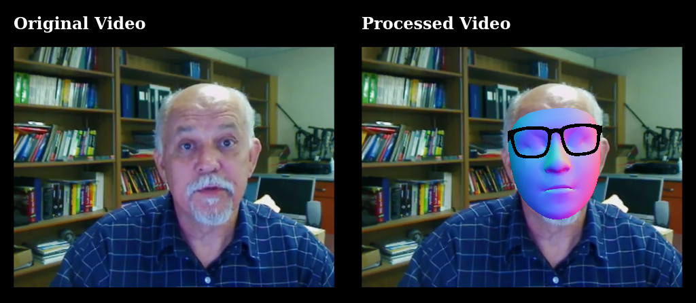

# Mediapipe Facemesh Effects


Realtime facemesh effects using mediapipe and Three JS. Works realtime even on older CPU like AMD Semprom 145.




## Demo
[Demo Link](https://breathingcyborg.github.io/mediapipe-face-effects)

## Todo
* add more face effects
* make it work on older android phones

## Building and running on localhost

Install dependencies:

```sh
yarn
```

Start development server:

```sh
yarn serve
```

Open `localhost:8080`

## Preparing glasses 3d model.

When using custom 3d glasses make sure the model is oriented in the right way. You can use [three js editor](https://threejs.org/editor/) or other tools like [gltfviewer](https://www.gltfviewer.com/) to check or correct orientation of glasses.


## Limitations

Face Transform Module is not available in facemesh javascript. So it does not give proper depth / z coordinates. So 3d effect look weird when using perspective camera.

While writing code to places objects relative to facemesh model, [facemesh model UV visualization](https://github.com/google/mediapipe/blob/master/mediapipe/modules/face_geometry/data/canonical_face_model_uv_visualization.png) can be helpful.
