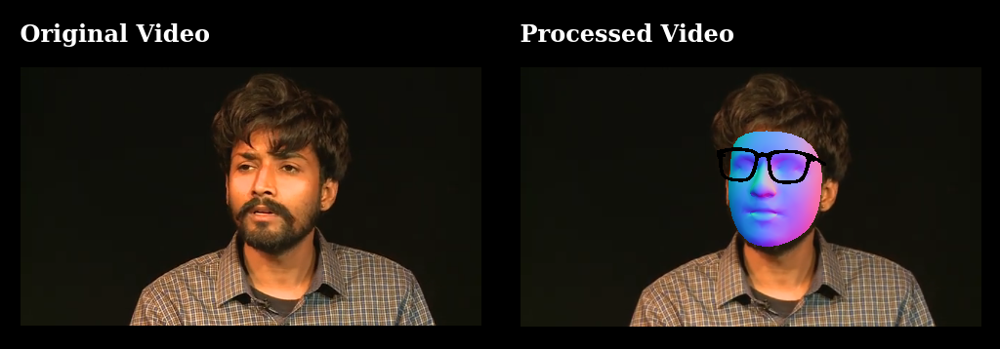

# Mediapipe Facemesh Effects


Realtime facemesh effects using mediapipe and Three JS. Works realtime even on older CPU like AMD Semprom 145.




## Demo
[Demo Link](https://breathingcyborg.github.io/mediapipe-face-effects)

## Todo
* add more face effects
* make it work on older android phones

## Building and running on localhost

Install dependencies:

```sh
yarn
```

Start development server:

```sh
yarn serve
```

Open `localhost:8080`
